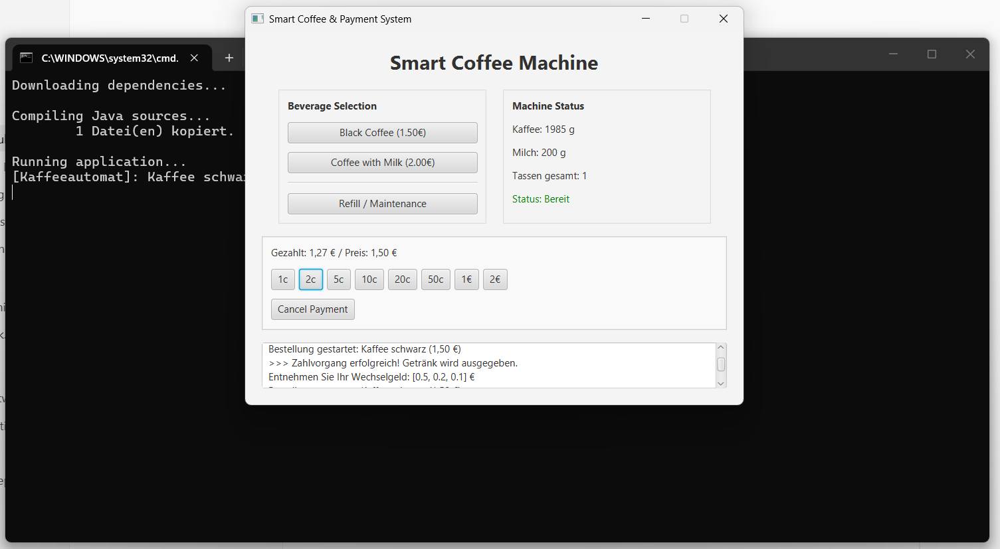

# ☕ Smart Coffee & Payment System

Ein modernes, leichtgewichtiges JavaFX-Anwendungssystem zur Simulation eines Verkaufsautomaten mit Kaffeezubereitung, Münzverarbeitung, Wechselgeldberechnung und SQLite-Datenbankanbindung.



---

## 📋 Inhaltsverzeichnis

- [Über das Projekt](#-über-das-projekt)
- [Funktionen](#-funktionen)
- [Technologien & Architektur](#-technologien--architektur)
- [Projektstruktur](#-projektstruktur)
- [Installation & Schnellstart](#-installation--schnellstart)
- [Datenbankschema](#-datenbankschema)
- [Lizenz & Autor](#-lizenz--autor)

---

## 💡 Über das Projekt

Das **Smart Coffee & Payment System** simuliert die vollständige Funktionalität eines gewerblichen Kaffeevollautomaten. Es kombiniert eine benutzerfreundliche grafische Oberfläche (JavaFX) mit robuster Backend-Logik zur Zutatenverwaltung, Münzverarbeitung und Buchhaltung in einer lokalen SQLite-Datenbank.

### Hauptmerkmale:
- **Zutatenverwaltung:** Automatische Überwachung von Kaffeebohnen-, Milch- und Tassenbeständen.
- **Münzwechsler-Logik:** Präzise Wechselgeldberechnung auf Cent-Ebene unter Verwendung eines Greedy-Algorithmus.
- **Sichere Datenbankanbindung:** Protokollierung aller Bestellungen, Einzahlungen und Münzbestände in SQLite mittels Prepared Statements.
- **Ausfallsicherheit:** Simulation von technischen Defekten mit integrierter Wartungs- und Auffüllfunktion.

---

## ✨ Funktionen

- ☕ **Getränkeauswahl:**
  - Schwarzer Kaffee (1,50 €)
  - Kaffee mit Milch (2,00 €)
- 🪙 **Münzeinzahlung:**
  - Unterstützung aller Euro-Münzen (1c, 2c, 5c, 10c, 20c, 50c, 1 €, 2 €).
  - Echtzeit-Anzeige des verbleibenden Restbetrags.
- 🧮 **Wechselgeld-Rechner:**
  - Automatische Ausgabe des Wechselgelds aus dem aktuellen Münzbestand.
  - Abbrechen-Funktion für laufende Zahlvorgänge.
- 🔧 **Wartung & Refill:**
  - Rücksetzen von Defekten und Auffüllen des Zutatenbestands per Klick.
- 📜 **Echtzeit-Log:**
  - Detaillierte Systemmeldungen direkt in der Benutzeroberfläche.

---

## 🛠️ Technologien & Architektur

- **Programmiersprache:** Java 21 / 17
- **GUI-Framework:** JavaFX 17+ (mit FXML)
- **Datenbank:** SQLite 3 (`sqlite-jdbc`)
- **Build-System:** Apache Maven & Standalone Batch-Skript (`run.bat`)
- **Architekturmuster:** MVC (Model-View-Controller)

---

## 📁 Projektstruktur

```text
SmartCoffeePaymentSystem/
├── src/
│   └── main/
│       ├── java/
│       │   └── com/smartcoffee/
│       │       ├── MainApp.java          # Einstiegspunkt der JavaFX-Anwendung
│       │       ├── GUIController.java    # FXML Controller & UI-Events
│       │       ├── Kaffeeautomat.java    # Hardware- & Ressourcen-Simulation
│       │       ├── Muenzwechsler.java    # Münzverarbeitung & Wechselgeld-Logik
│       │       └── DatenbankManager.java # SQLite-Anbindung & Prepared Statements
│       └── resources/
│           └── main_view.fxml            # FXML-Layout der Benutzeroberfläche
├── docs/
│   └── ui_screenshot.png                 # UI Screenshot
├── .gitignore                            # Ausschlussregel für temporäre Dateien
├── pom.xml                               # Maven Projektkonfiguration
├── run.bat                               # Standalone Start-Skript für Windows
└── README.md                             # Projektdokumentation
```

---

## 🚀 Installation & Schnellstart

### Voraussetzungen
- **Java Development Kit (JDK 17 oder 21)** installiert.

---

### Option 1: Schnellstart per Doppelklick (Windows)

1. Projekt aus GitHub herunterladen oder klonen:
   ```bash
   git clone https://github.com/Jalal-Sbai/SmartCoffeePaymentSystem.git
   ```
2. Im Projektordner die Datei **`run.bat`** doppelklicken.  
   *(Das Skript lädt beim ersten Aufruf automatisch benötigte JAR-Bibliotheken herunter, kompiliert den Code und startet das Anwendungssystem).*

---

### Option 2: Über die Eingabeaufforderung / PowerShell

```powershell
# In den Projektordner wechseln
cd SmartCoffeePaymentSystem

# Startskript ausführen
.\run.bat
```

---

### Option 3: Über Maven

```bash
# Projekt kompilieren
mvn clean compile

# Anwendung ausführen
mvn javafx:run
```

---

## 🗄️ Datenbankschema

Das System verwendet eine SQLite-Datenbank (`coffee_system.db`) mit folgendem relationalem Schema:

### 1. `Bestellungen`
| Spalte | Typ | Beschreibung |
| :--- | :--- | :--- |
| `ID` | INTEGER (PK, AUTOINCREMENT) | Eindeutige Bestellnummer |
| `Kaffeeart` | TEXT | Name des Getränks |
| `MitMilch` | BOOLEAN | Enthaltene Milchoption |
| `Preis` | REAL | Preis in Euro |
| `Zeitstempel` | DATETIME | Erstellungszeitpunkt |

### 2. `Münzbestand`
| Spalte | Typ | Beschreibung |
| :--- | :--- | :--- |
| `Münztyp` | REAL (PK) | Münzwert in Euro (z. B. 0.50, 1.00) |
| `Anzahl` | INTEGER | Vorhandene Anzahl der Münzen im Automat |

### 3. `Zahlungen`
| Spalte | Typ | Beschreibung |
| :--- | :--- | :--- |
| `ID` | INTEGER (PK, AUTOINCREMENT) | Eindeutige Zahlungs-ID |
| `Bestellung_ID`| INTEGER (FK) | Verweis auf die Bestellung |
| `Münztyp` | REAL | Wert der eingeworfenen Münze |
| `Anzahl` | INTEGER | Anzahl |

---

## 👤 Autor

Entwickelt von **[Jalal Sbai](https://github.com/Jalal-Sbai)**.
